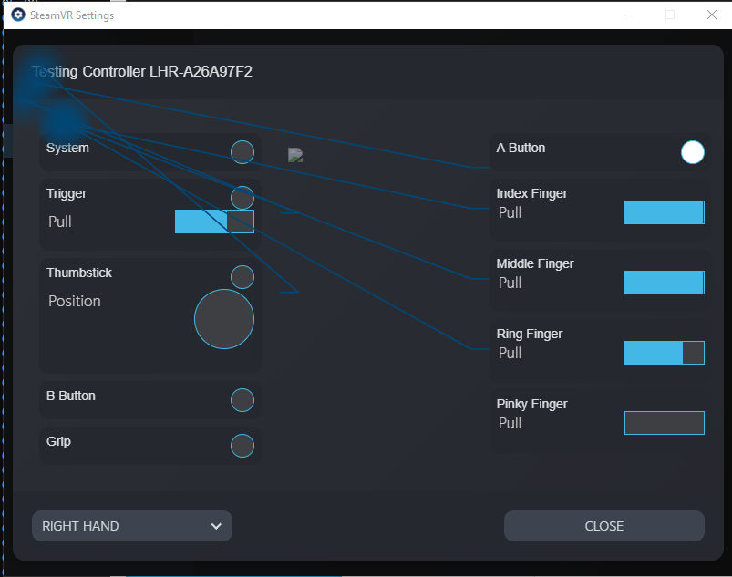

The following repository contains some examples of how to use the Tundra Labs RP2040 Breakout Board with Tundra Tracker to send custom controller information.

## Structure
Each example is composed of some folders:
* Arduino
    * This is the RP2040 Arduino code that is programmed into the Dev board
    * Example will include a snapshot of the TMI library that was tested at the time of uploading
    * Future inprovements could have been made to the library in other examples
* Device JSON
    * ALWAYS BEFORE WRITING JSON Files, perform a `downloadconfig backup.json` command  
    * The example.json is partially defined file that does not contain sensor calibration data
    * to merge the `backup.json` and `example.json` files together, copy the `"lighthouse_config"` and `"imu"` blocks from `backup.json` into `example.json`, save as to `new.json`
    * ALWAYS preserve a copy of `backup.json` to revert your tracker to the original calibration
    * upload a new json config to your device in lighthouse console using `uploadconfg new.json`
    * Inevitably everyone at some point looses a Json file or writes it to the wrong device :(
        * Find archives in your PC in the following folder: `C:\Program Files (x86)\Steam\config\lighthouse`
        * Here you will find a json file from every serial number device that you have ever connected to steam (Thanks Valve!)
* Driver folder
    * Drivers are a collection of files that tell SteamVR about your device.
    * Drivers are added to the following folder: `C:\Program Files (x86)\Steam\steamapps\common\SteamVR\drivers`
    * The Device JSON will indicate the search directory to find your driver
    * Inside of the driver folder there resources structure
        * icons - This is where you store your SteamVR icons, the primary icons that you should have are:
            * x_status_error.png
            * x_status_ready.png
            * x_status_off.png
            * x_status_searching.gif
            * x_status_standby.png
            * (SteamVR will autogenerate other versions of your icons)
        * rendermodels - This is where you store the .obj and .mtl files for your device.
            * Creates the 3D model that appears in SteamVR when your device is active
        * localization - a json file that translates your device strings to other languages
        * input - a folder that contains all of the details of your device inputs.  There will be an entire section on this one...

## Input Files
Input files describe to SteamVR the structure of your input data and how to publish it to the SteamVR input system.  This is the PC side of the customization that is done in the Arduino code.  This section shall describe in more detail how to author the input json files and get your controller inputs into SteamVR.


### x_profile.json file
There are 2 main sections of a input profile: `"input_source"` and `"input_components"`

#### Input Source
Contains a list of sources, each source has a syntax like:

```
"/<input or output or pose>/<name>" : {
  "type" : "<type>",
  "touch" : "<true or false>",
  "click" : "<true or false>",
  "value" : "<true or false>",
  "force" : "<true or false>",
  "binding_image_point" : [ <x_loc>, <y_loc> ],
  "order" : <order>
}
```
`<order>` entry describes what order in the input list that the entry should appear.
`<x_loc>` and `<y_loc>` indicate the coordinates on the `input_bindingui` image that the input will have a leader annotating to.

`<type>` can be one of the following:
* `"button"`
* `"trigger"`
* `"joystick"`
* `"trackpad"`
* `"vibration"`
* `"pose"`

There are also a collection of other attributes, for example:
* `"touch"` - Set to True if the input has a touch/not touch state, for example a button capsense
* `"click"` - Set to True if the input has a click state, for example when a button or trigger is fully pressed, or a Thumbstick press
* `"value"` - Set to True if the input has a analog value, for example a trigger pull
* `"force"` - Set to True if the input has a force measurement, for example the Index Controller trackpad or grip sensor

Here is a sample from the index_controller_profile.json:
```
 "input_source" :
  {
    "/input/system" : {
      "type" : "button",
      "click" : true,
      "touch" : true,
      "binding_image_point" : [ 34,45 ],
      "order" : 1
    },
    "/input/a" : {
      "type" : "button",
      "click" : true,
      "touch" : true,
      "binding_image_point" : [ 26, 42 ],
      "order" : 6
    },
    "/input/b" : {
      "type" : "button",
      "click" : true,
      "touch" : true,
      "binding_image_point" : [ 18, 37  ],
      "order" : 5
    },
    "/input/trigger" : {
      "type" : "trigger",
      "click" : true,
      "touch" : true,
      "value" : true,
      "binding_image_point" : [ 11, 60 ],
      "order" : 2
    },
    "/input/trackpad" : {
      "type" : "trackpad",
      "force" : true,
      "touch" : true,
      "binding_image_point" : [ 27, 37 ],
      "order" : 3
    },
    "/input/grip" : {
      "type" : "trigger",
      "force" : true,
      "value" : true,
      "touch" : true,
      "input_activity_path" : "/input/grip/force",
      "input_activity_threshold" : 0.1,
      "binding_image_point" : [ 47, 86 ],
      "order" : 7
    },
    "/input/thumbstick" : {
      "type" : "joystick",
      "click" : true,
      "touch" : true,
      "binding_image_point" : [ 31, 26 ],
      "order" : 4
    },
    "/input/pinch" : {
      "type" : "pinch",
      "value_source" : "/input/trigger",
      "capsense_source" : "/input/finger/index",
      "force_source" : "/input/trackpad",
      "binding_image_point" : [ 27, 37 ],
      "order" : 8
    },

    "/input/finger/index" : {
      "type" : "trigger",
      "visibility" : "InputValueVisibility_AvailableButHidden",
      "binding_image_point" : [ 56, 86 ],
      "order" : 100
    },
    "/input/finger/middle" : {
      "type" : "trigger",
      "visibility" : "InputValueVisibility_AvailableButHidden",
      "binding_image_point" : [ 56, 86 ],
      "order" : 101
    },
    "/input/finger/ring" : {
      "type" : "trigger",
      "visibility" : "InputValueVisibility_AvailableButHidden",
      "binding_image_point" : [ 56, 86 ],
      "order" : 102
    },
    "/input/finger/pinky" : {
      "type" : "trigger",
      "visibility" : "InputValueVisibility_AvailableButHidden",
      "binding_image_point" : [ 56, 86 ],
      "order" : 103
    },

    "/pose/raw" : {
      "type" : "pose",
      "binding_image_point" : [ 5, 35 ]
    },
    "/pose/base" : {
      "type" : "pose",
      "binding_image_point" : [ 65, 136 ]
    },
    "/pose/handgrip" : {
      "type" : "pose",
      "binding_image_point" : [ 56, 95 ]
    },
    "/pose/tip" : {
      "type" : "pose",
      "binding_image_point" : [ 5, 35 ]
    },
    "/pose/gdc2015" : {
      "type" : "pose",
      "binding_image_point" : [ 5, 35 ]
    },

    "/input/skeleton/left" : {
      "type" : "skeleton",
      "skeleton": "/skeleton/hand/left",
      "side" : "left",
      "binding_image_point" : [ 5, 35 ]
    },
    "/input/skeleton/right" : {
      "type" : "skeleton",
      "skeleton": "/skeleton/hand/right",
      "side" : "right",
      "binding_image_point" : [ 5, 35 ]
    },

    "/output/haptic" : {
      "type" : "vibration",
      "binding_image_point" : [ 5, 35 ]
    }
  },
```
#### Input Components
For controllers that use mapped input, the `"input_components"` structure describes how SteamVR should unpack data from the data structure.  The general format is:
```
"/<input or output or pose>/<name>/<attribute>": {
            "bit_offset": <bit_offset>,
            "bit_width": <bit_offset>,
            "type": "<type>"
            "min": <minimum>,
            "max": <maximum>,
            "unit": "<unit>",
            "special_value_zero":<special value>
        },
```
the beginng of the path should be matching a path specified in `"input_source"`, this is followed by a `<attribute>`.  The attribute should be one of the following:
* `click` - Used for a button click
* `touch` - Used to indicate when a input is touched
* `x` - Used to indicate x coordinate of a thumbstick or trackpad
* `y` - Used to indicate y coordinate of a thumbstick or trackpad
* `value` - Used for a analog value, for example a finger curl or trigger pull
* `force` - Used for a force value

In the mapped input protocol, data for the inputs is tightly packed into a array of bytes.  The `"bit_offset"` and `"bit_width"` describes the data location and size so that it can be extracted from the tight array. 
* `<bit_offset>` - is a integer value to indicate the first bit of data for a particular input.
* `<bit_width>` - how many bits wide the input is, for example a button would always be 1 bit wide whereas a trigger analog value may be 10bits wide

A `<type>` for the input component could be one of the following:
* `"bool"` - Example is a button or touch value that is either on or off
* `"scalar"` - a numeric value, for example a trigger pull

For input components that are of `"type : "scalar"` there are some additional parameters to use in order to convert unsigned integers sent in the packet to scalar values.  In the SteamVR input system, all scalars are floats either from 0 to 1 (`"unit" : "onesided"`) or from -1 to 1 (`"unit" : "twosided"`).  In order to convert the integers into scalar values, the following formula is used:

`(value - minmum) / (maximum - minimum)`

the `<minimum>` and `<maximum>` are integer values given in the description.

If a input_component is of `"unit" : "twosided"` an additional step is taken to calculate the scalar:

`( 2 * (value - minmum) / (maximum - minimum) ) - 1`

Since this conversion is done in floating point math, it can be impossible to achieve a scalar that is exactly 0, sometimes game developers rely of values of exactly 0 to decide that a trackpad is idle or a touchpad is not touched.

For this reason, there is a parameter called "special_value_zero".  This is an override of the formulas above where if the value of an input is equal to the integer stated for special value zero, then the input will return an exact value of 0.0.

The following is an example of input_components for the Logitech VR Ink pen:
```
    "input_components": {
        "/input/system/click": {
            "bit_offset": 0,
            "type": "bool"
        },
        "/input/menu/click": {
            "bit_offset": 1,
            "type": "bool"
        },
        "/input/touchstrip/click": {
            "bit_offset": 2,
            "type": "bool"
        },
        "/input/primary/force": {
            "bit_offset": 3,
            "bit_width": 10,
            "type": "scalar",
            "min": 0,
            "max": 1023,
            "unit": "onesided"
        },
        "/input/tip/force": {
            "bit_offset": 13,
            "bit_width": 10,
            "type": "scalar",
            "min": 0,
            "max": 1023,
            "unit": "onesided"
        },
        "/input/grip/force": {
            "bit_offset": 23,
            "bit_width": 10,
            "type": "scalar",
            "min": 0,
            "max": 1023,
            "unit": "onesided"
        },
        "/input/touchstrip/x": {
            "bit_offset": 33,
            "bit_width": 8,
            "type": "scalar",
            "min": 30,
            "max": 169,
            "unit": "twosided",
            "special_value_zero":0
        },
        "/input/touchstrip/y": {
            "bit_offset": 41,
            "bit_width": 10,
            "type": "scalar",
            "min": 30,
            "max": 769,
            "unit": "twosided",
            "special_value_zero":0
        },
        "/input/touchstrip/touch": {
            "bit_offset": 51,
            "type": "bool"
        },
        "/output/haptic" : {
            "type" : "vibration"
        }
    }
```

## Input Debugging
To debug your input, you can access the debugger by selecting Devices > Controller Settings > Test Controller.  Then selecting your controller from the list in the lower left drop down selector.



## Support for Original Breakout Board
These examples are best tested with the Tundra Labs RP2040 Breakout board.  It is however possible to connect a development board to the tracker using the original Breakout board.  The following is how to make the connections:

| IOBB Pin Name | Description | RP2040 Pin  |
| ------------- | ----------- | ----------- |
| Trigger       | MISO        | 15          |
| Menu          | MOSI        | 12          |
| Grip          | SCLK        | 14          |
| Trackpad      | CSN         | 13          |

RP2040 is not the only MCU where this protocol is possible but it is the only MCU that we will support.  Advanced developers can implement their own SPI Slave drivers for other MCUs and communicate with Tundra Tracker as well.  We can unnofficially link you GitHub projects here: