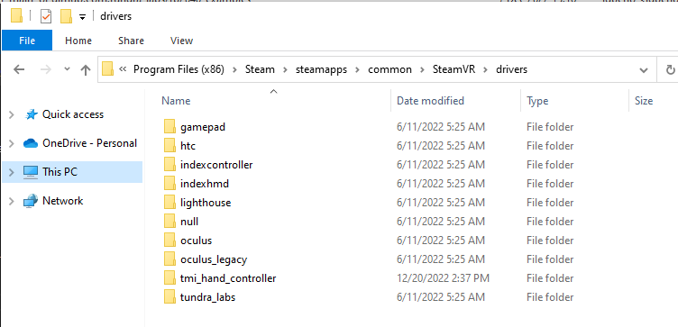
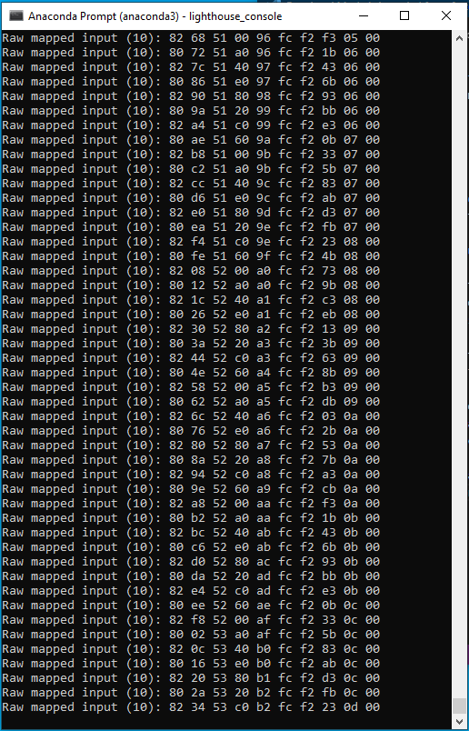

## tmi_hand_controller
This project demonstrates standalone code running on RP2040 the generate simulated input data for a index controller like device.  If includes datastructures for a thumbstick, A and B button plus a menu and system button.

You can use the provided cables to upload the Arduino sketch to the RP2040 Breakout Board

## Step 1: SteamVR Driver installation 
In order to install the tmi_hand_controller Controller StewamVR driver you must copy the `tmi_ hand_controller\driver/tmi_hand_controller` folder to the SteamVR directory typically located at 
`C:\Program Files (x86)\Steam\steamapps\common\SteamVR\drivers`



the structure inside of `C:\Program Files (x86)\Steam\steamapps\common\SteamVR\drivers\tmi_hand_controller` should look like this:


## Step 2: Modify the Tundra Tracker Device JSON Configuration

***Caution, do not connect any other SteamVR devices to your PC during testing.  Especially your HMD***

To verify that this input data is being sent to the PC, you must:

1) Connect your tracker to your PC via USB, disconnect all dongles, HMD, controller, etc
2) Start lighthouse_console from `C:\Program Files (x86)\Steam\steamapps\common\SteamVR\tools\lighthouse\bin\win32`
3) Verify that there is only one device connected:


***If you have more than one device listed here, do not move forward, disconnect everything else!***

4) download a backup of the Tracker json file using `downloadconfig backup.json`
4) download the Tracker json file using `downloadconfig t.json`
5) open the configuration and add the following line to the `"firmware_config":{...}` block
  `"mapped_input" : true`
6) Modify these other lines of your JSON at the root of the structure
```
   "device_class" : "controller",
   "device_serial_number" : "LHR-A6B3A15B",
   "manufacturer" : "Tundra Labs",
   "model_number" : "Tundra Hand Controller",
   "render_model" : "{tmi_hand_controller}/tmi_hand_controller",
   "resource_root" : "tmi_hand_controller",
   "input_profile" : "{tmi_hand_controller}/input/tmi_hand_controller_profile.json",
   "revision" : 1,
```
7) save t.json
8) start lighthouse_console again and use 'uploadconfig t.json' to upload the revised JSON file to the tracker
9) use the command `reboot` to restart the tracker
10) when the tracker is restarted, type the `axis` command to dump out input data to the console

You should see an output like below:


## Step 3: Start SteamVR
You should be able to launch SteamVR and see a controller icon, once tracking is established, the Icon will turn from flashing to solid:


*** Note: Controller outputs will not be published unless tracking is established ***

Use the Devices > Controller Settings > Test Controller to verify that the outputs are changing:


## Step 4: Modification
The sample code in this repository creates the datastructure and then uses code in the loop function to increment the inputs.  This makes a quick demo without the need for someone to attach sensors or write additional Arduino code to read sensors.  Now that you have the rest of the demo verified, modify the Arduino code to mix in your own sensors and build something fun!

Please be sure to share your projects with us on twitter!

@tundra_labs

## Step 5: Getting back to Original Tracker Functions
If following the instructions, you should have archived a backup of your device json.  To undo, just upload this json again to your tracker:

***Caution, do not connect any other SteamVR devices to your PC during testing.  Especially your HMD***

To verify that this input data is being sent to the PC, you must:

1) Connect your tracker to your PC via USB, disconnect all dongles, HMD, controller, etc
2) Start lighthouse_console from `C:\Program Files (x86)\Steam\steamapps\common\SteamVR\tools\lighthouse\bin\win32`
3) Verify that there is only one device connected:


***If you have more than one device listed here, do not move forward, disconnect everything else!***

4) upload the backup of the Tracker json file using `uploadconfig backup.json`
5) use the command `reboot` to restart the tracker

Inevitably everyone at some point looses a Json file or writes it to the wrong device :(
  
* Find archives in your PC in the following folder: `C:\Program Files (x86)\Steam\config\lighthouse`
* Here you will find a json file from every serial number device that you have ever connected to steam (Thanks Valve!)
